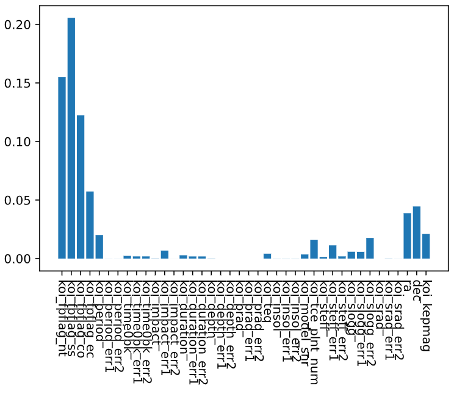

# machine-learning-challenge

# Process

## Feature Selection
To find prominent features to train on for the final models, Feature Importance measures of inital, trained models were used. The models used were the DecisionTreeClassifier and KNeighborsClassifier algorithms, built and reviewed in feature_review.ipynb. These two models yielded the following results:

Decision Tree Prominent Features:\
(0.19498480426684972, 'koi_fpflag_nt'),\
(0.18322372199330475, 'koi_fpflag_co'),\
(0.1733182396202466, 'koi_fpflag_ss'),\
(0.13388952480981978, 'koi_model_snr')\

KNN Prominent Features:\
(0.2056456227350753, 'koi_fpflag_ss'),\
(0.1551020408163265, 'koi_fpflag_nt'),\
(0.12229639519359148, 'koi_fpflag_co')\

The features ultimately decided to train the two modesl became the following:\
koi_fpflag_nt\
koi_fpflag_co\
koi_fpflag_ss\
koi_model_snr\

# Model Training
Three models were trained using the following three algorithms: RandomForestClassifier, SVC and KNeighborsClassifier. The data to be trained from the selected features was scaled with MinMaxScalar, then fitted to each model. A GridSearchCV model was then created for each algorithm in attempts to improve accuracy ratings, resulting in the following performances:

KNeighbors\
Parameters: {'leaf_size': 5, 'n_neighbors': 20}\
Accuracy: 0.8580925854503381

Random Forest\
Parameters: {'max_depth': 10, 'min_samples_split': 100}\
Accuracy: 0.8624786237710941

SVC\
Parameters: {'C': 5, 'gamma': 1e-06}\
Accuracy: 0.7547176882381621\

# Results
The resulting KNeighbors and Random Forest models scored higher than 85% accuracy, making these suitable for application on new data. As this is only a model, any results from the model should be forwarded to subject matter experts to further investigate the candidate observations. The SVC model showed less than desireable accuracy at 71% and will not be considered for application.

The results also show that the four selected features likely serve as good indicators of whether the KOI in question is an exoplanet or not.

Models will be good enough to find exoplanets, as they are at 85% accuracy, though will require subject matter expertise to confirm findings.
